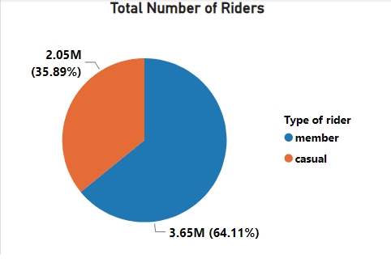
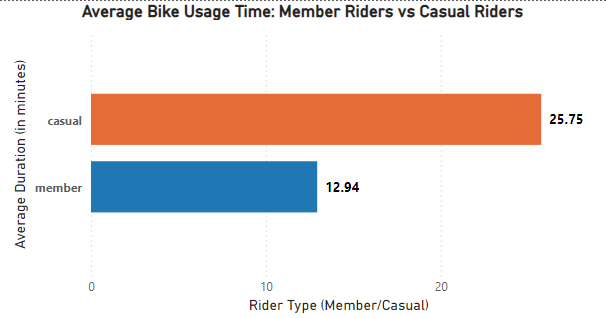
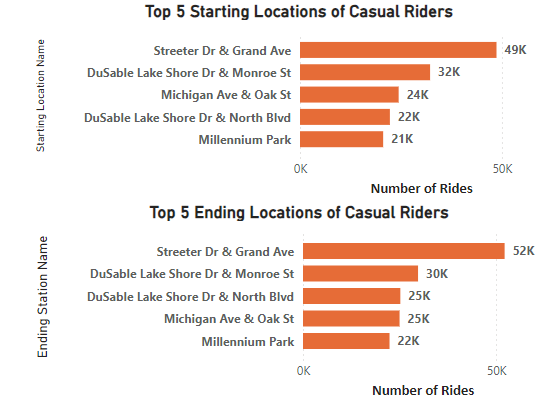
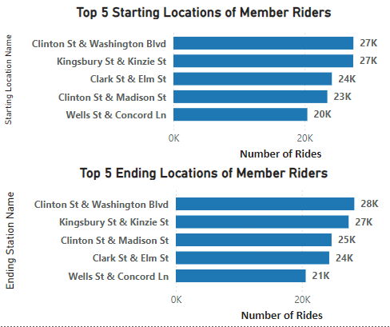
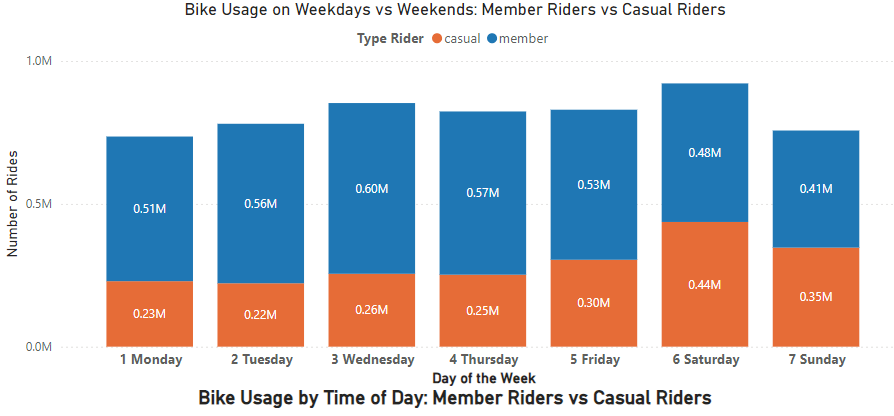
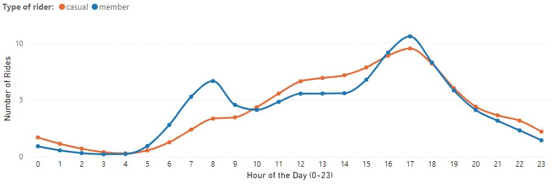
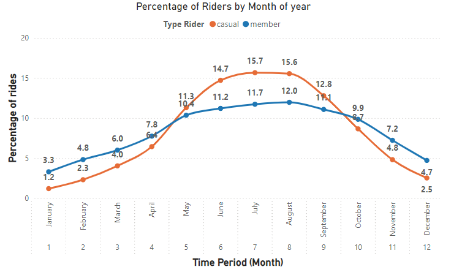

As part of my journey to develop my skills as a data analyst, I am working through this case study to showcase my approach to problem-solving and data-driven decision-making. In this project, I will walk through each step of the analysis process, allowing recruiters and hiring managers to gain insight into my analytical thinking, methodology, and how I derive actionable conclusions from data.

# Introduction
 
**Cyclistic, a Chicago-based bike-sharing company, serves two distinct customer segments:**

1.	Occasional riders who purchase single-ride or daily passes, are referred to as casual riders.
2.	Annual subscribers, referred to as members.
According to Cyclistic’s financial analysis team, annual members generate significantly higher revenue compared to casual riders. The marketing director believes that increasing the number of annual members is crucial for the company's future growth.

To support this goal, the marketing analytics team seeks to understand how casual riders and members differ in their usage of Cyclistic bikes. This insight will inform a new marketing strategy aimed at converting casual riders into annual members. The primary stakeholders of this project are Cyclistic’s marketing director and executive team, while the marketing analytics team is considered a secondary stakeholder.

## Business Task:
The goal of this case study is to analyze how casual riders and annual members of Cyclistic differ in their usage of the bike-sharing service. By identifying key patterns in their behavior, the aim is to develop insights that will support the marketing team in creating strategies to convert casual riders into annual members, thereby increasing the company’s overall profitability.

________________________________________
**Research Questions:**

**1.	Is there a difference in bike usage time between casual riders and members?**
   
Understanding the difference in the duration of bike usage between casual riders and members can help identify patterns in how these two groups utilize the service. If casual riders generally take shorter trips, a strategy could involve promoting longer trips as a benefit of membership.

**2.	What are the most popular starting and ending locations for casual riders compared to members?**

By analyzing where casual riders and members start and end their trips, we can gather insights into how the two groups use the service. Casual riders might prefer more tourist-oriented or leisure-based locations, while members may focus on daily commuting routes. This information can guide location-specific marketing efforts.

**3.	How do weekends affect the usage of bikes for casual riders compared to members?**

Exploring how bike usage changes on weekends compared to weekdays will help identify whether casual riders are more likely to use the service for leisure during weekends, while members might maintain a more consistent usage throughout the week. This insight can help shape campaigns aimed at converting weekend users to frequent members.

**4.	Is there a difference in usage patterns at different times of the day between casual riders and members?**

Examining the times of day when casual riders and members use bikes can reveal different habits. For example, casual riders might prefer afternoons or evenings for leisure rides, whereas members may use the bikes during peak commuting hours. These insights can inform time-based promotional offers or targeted marketing.

**5.	How many rides do casual riders take on average compared to members over a week or month?**

This question aims to quantify the frequency of rides between the two groups. Members are likely to use bikes more regularly, so understanding the gap in ride frequency can help in determining how to encourage casual riders to increase their usage or commit to an annual membership.
________________________________________

### Prepare and Process Phases:
For this analysis, I gathered trip data for the last 12 months [from here](https://divvy-tripdata.s3.amazonaws.com/index.html), covering the period from September 2023 to August 2024. The dataset includes information for both casual riders and members of the Cyclistic bike-sharing service. Here's how I approached the data preparation and cleaning process:

**1.	Data Collection:**
I downloaded individual .csv files for each month and consolidated the data into a single dataset using the R programming language. Specifically, I used the **list.files(), lapply(), and bind_rows()** functions to read and merge the files. You can view the script R [here](./Scripts/Data_Cleaning_Cyclist.R)

**2.	Dataset Columns:**
The unified dataset contains the following key columns:

**o	ride_id:** Unique identifier for each trip

**o	rideable_type:** Type of bike (classic or electric)

**o	started_at:** Start time of the trip

**ο	ended_at:** End time of the trip

**o	start_station_name:** Name of the starting station

**o	start_station_id:** ID of the starting station

**o	end_station_name:** Name of the ending station

**o	end_station_id:** ID of the ending station

**o	start_lat:** Latitude of the starting location

**o	start_lng:** Longitude of the starting location

**o	end_lat:** Latitude of the ending location

**o	end_lng:** Longitude of the ending location

**o	member_casual:** Rider type (casual or member)

**3.	Data Cleaning:**

To streamline the dataset and improve performance, I replaced the **ride_id**, which consisted of long strings, with a simpler numeric ID. Additionally, I renamed some columns to make them more readable:

**o**	start_lat → start_latitude

**o**	start_lng → start_longitude

**o**	end_lat → end_latitude

**o**	end_lng → end_longitude

**4.	Data Storage:**

After cleaning the dataset, I exported the consolidated data into a .csv file and imported it into Microsoft SQL for further analysis and querying.

### Analysis Phase (Data Collection and Insights)

Data from the last 12 months (September 2023 to August 2024) was collected, comprising approximately 5.7 million bike rides. The dataset provided key insights into usage patterns by both casual riders and members.

•	Members: Completed 3.65 million rides, accounting for **64.11% of the total.**

•	Casual Riders: Completed 2.05 million rides, making up **35.89% of the total.**

### Observations:

[(SQL Queries)](./Scripts/Sql_Queries_Cyclist.sql)

**1.	Average Ride Duration:**

o	Casual riders use bikes for an average of **25.75 minutes per ride.**

o	Members use bikes for significantly less time, averaging **12.94 minutes per ride.**

Casual riders spend double the time per ride compared to members, **which likely reflects their more leisurely or tourist-oriented use of the service.**

**2.	Missing Data:**

o	Out of the 5,699,639 rides, there were 968,697 missing values in the start_station_name column **(17%)** and 1,006,133 missing values in the end_station_name column **(17.65%).**

These gaps slightly affect the precision of location-based analysis, but the impact on the overall findings remains minimal.

**3.	Starting and Ending Locations:**

o	Member Riders: Common starting and ending locations for members include areas near offices, shops, and transportation hubs, indicating that members predominantly use bikes for commuting or practical daily transportation. Key stations include **Clinton St & Washington Blvd, Kingsbury St & Kinzie St, and Clark St & Elm St.**

o	Casual Riders: The most popular locations for casual riders are near tourist attractions and recreational areas, such as **Streeter Dr & Grand Ave, DuSable Lake Shore Dr & Monroe St, and Millennium Park**, which aligns with their leisure-based usage patterns.

**4.	Weekend Usage Patterns:**

**o	Members:** Bike usage decreases significantly during weekends, suggesting members primarily use the service for commuting on weekdays.

**o	Casual Riders:** On the contrary, casual riders increase their bike usage on weekends, particularly on Saturdays. This indicates that casual riders are **more likely** to use bikes for recreational purposes during their free time.

**5.	Time of Day:**

**o	Members:** Peak bike usage occurs during commuting hours, notably **at 8:00 AM and 5:00 PM**, aligning with the start and end of the typical workday.

**o	Casual Riders:** Their usage peaks between **10:00 AM and 4:00 PM**, suggesting that casual users prefer riding during the middle of the day when they are likely engaging in recreational activities.

**6.	Seasonality:**

**o	Casual Riders:** Casual rider usage is concentrated during the warmer months (May to September), **accounting for 70% of their annual rides**, which reinforces the idea that casual riders use bikes mainly for leisure.

**o	Members:** Member usage is more stable year-round, with **56.4% of their rides occurring in the same warmer months**. However, they maintain steady activity throughout the year, likely due to the practical nature of their bike use.

## Conclusions

From this analysis, it’s clear that casual riders predominantly use the bike-sharing service for leisurely rides, especially in tourist-heavy areas and during the summer months. They are less likely to ride during commuting hours or outside peak tourism seasons. Conversely, members primarily use the service for commuting, showing more consistent usage throughout the week and across all months.
The difference in ride durations also supports this conclusion: members are time-conscious and use the bikes to cover short distances efficiently, whereas casual riders are more likely to enjoy longer, unhurried rides.

### Recommendations for Stakeholders

Given these insights, several strategies can be recommended to encourage casual riders to upgrade to members:

**1.	Targeted Promotions During Tourist Seasons:**

o	Offer seasonal membership discounts or trial memberships to casual riders during the peak summer months when they are more likely to use bikes frequently. Providing a summer pass with limited-time access at a discounted rate could introduce them to the benefits of membership without the year-round commitment.

**2.	Flexible Membership Plans:**

o	Introduce flexible memberships that cater to tourists or those who use the service mainly for recreation. For instance, a "weekend membership" or "vacation pass" could be attractive to casual riders who frequently bike on weekends or during vacations.

**3.	Incentives for Commuters:**

o	Since casual riders are not using the bikes for commuting, consider incentivizing the use of bikes for practical purposes. For example, offering discounts for rides taken during commuting hours or bundling bike memberships with public transportation passes could encourage casual riders to adopt the service for daily transportation needs.

**4.	Member Perks for Leisure Activities:**

o	Leverage the popular tourist locations by partnering with local attractions or events. Offer exclusive discounts to members for bike rentals near key tourist hotspots, which could appeal to casual riders interested in leisure but also looking for cost savings on frequent rides.

**5.	Enhance Engagement Through the App:**

o	Use the bike-sharing app to track milestones (such as the number of rides taken, calories burned, or environmental impact) and offer casual riders rewards or badges. Present members with the opportunity to earn membership upgrades or loyalty bonuses after reaching certain milestones.
By understanding the distinct usage patterns of casual riders versus members, these targeted strategies can help convert casual users into loyal members, driving long-term revenue and fostering a more engaged community of riders.

